# Project Lifecycle Flow

> Progressive project evolution: Macro → Micro

## Overview

The project evolves progressively, starting from a macro view that is refined
gradually as interactions advance. The **default path** uses `/speckit-context` and
`/speckit-constitution` first; `/speckit-triage` is an **optional** helper when the
initial input is large or mixed.


## Central Artifacts

The project lifecycle is guided by two central artifacts:

### project-workplan.md (Orchestration)

`project-workplan.md` is the **agent orchestration plan**.

```mermaid
%%{init: {'theme': 'base', 'themeVariables': { 'primaryTextColor': '#000', 'secondaryTextColor': '#000', 'tertiaryTextColor': '#000', 'lineColor': '#333'}}}%%
flowchart LR
    subgraph Workplan["📋 project-workplan.md"]
        direction TB
        Phase["🎯 Current Phase<br/>Which agent next"]
        Agents["⚙️ Agent Plan<br/>Status per command"]
        DPs["🔀 Decision Points<br/>DP1, DP2..."]
        Rounds["📝 Triage Rounds<br/>Progressive log"]
        Backlog["📦 Backlogs<br/>Constitution + Specs"]
    end
    
    style Workplan fill:#e8f5e9,stroke:#4caf50,color:#000
```



**Contains**:
- **Current Phase**: Which agent to call next
- **Agent Execution Plan**: Status of each command (TODO/IN_PROGRESS/DONE)
- **Decision Points**: DP1 (Project Structure), DP2 (Tech Stack)
- **Triage Rounds Log**: Progressive refinement history
- **Backlog Summary**: Pending items for constitution and specs
- **Project Start Checklist**: Step-by-step for new projects

### project-overview.md (Macro View)

`project-overview.md` is the project's **visual dashboard**.

### Contains

```mermaid
%%{init: {'theme': 'base', 'themeVariables': { 'primaryTextColor': '#000', 'secondaryTextColor': '#000', 'tertiaryTextColor': '#000', 'lineColor': '#333'}}}%%
flowchart LR
    subgraph Overview["📊 project-overview.md"]
        direction TB
        Macro["🎯 Macro View<br/>Blocks diagram"]
        Status["📈 Status<br/>Completion table"]
        Gaps["⚠️ Gaps<br/>Open items list"]
        History["📝 History<br/>Overview versions"]
    end
    
    style Overview fill:#fff9c4,stroke:#fbc02d,color:#000
```



### Both Artifacts Are Updated By

| Command | Workplan Updates | Overview Updates |
|---------|------------------|------------------|
| `/speckit-context` | Creates workplan + overview | Creates overview V0 |
| `/speckit-triage` (optional) | Logs round, updates phase, backlogs | Creates/updates macro blocks, gaps |
| `/speckit-constitution` | Marks phase DONE, updates DP2 | – |
| `/speckit-specify` | Updates spec backlog, phase status | Updates specs status, resolves gaps |
| `/speckit-plan` | Marks phase, updates DP1 | Adds technical view, updates status |
| `/speckit-tasks` | Marks phase DONE | Updates task count |
| `/speckit-implement` | Marks phase, next recommendation | Updates code progress, refinements |

## Visual Evolution

### V1: After Triage (Macro View)

```mermaid
%%{init: {'theme': 'base', 'themeVariables': { 'primaryTextColor': '#000', 'secondaryTextColor': '#000', 'tertiaryTextColor': '#000', 'lineColor': '#333'}}}%%
flowchart TD
    subgraph System["🎯 My Project"]
        B1["📦 Authentication ?"]:::gap
        B2["📦 Dashboard ?"]:::gap
        B3["📦 Reports ?"]:::gap
    end
    
    User([👤 User]) --> B1
    B1 --> B2
    B2 --> B3
    
    classDef gap fill:#ffcdd2,stroke:#c62828,stroke-dasharray:5,color:#000
```



**V1 Characteristics**:
- Functional blocks identified
- All with gap notation (?)
- Basic connections inferred
- Status: 🔴 Not started

### V2: After Specs (More Detail)

```mermaid
%%{init: {'theme': 'base', 'themeVariables': { 'primaryTextColor': '#000', 'secondaryTextColor': '#000', 'tertiaryTextColor': '#000', 'lineColor': '#333'}}}%%
flowchart TD
    subgraph System["🎯 My Project"]
        B1["📦 Authentication<br/>OAuth2 + JWT"]
        B2["📦 Dashboard<br/>Real-time metrics"]
        B3["📦 Reports ?"]:::gap
    end
    
    User([👤 User]) --> B1
    B1 -->|Token| B2
    B2 -->|Aggregated data| B3
    
    classDef gap fill:#ffcdd2,stroke:#c62828,stroke-dasharray:5,color:#000
```



**V2 Characteristics**:
- Some blocks fully detailed
- Connections with specific data flows
- Remaining gaps explicitly visible
- Status: 🟡 In progress

### V3+: After Plans and Implementation

```mermaid
%%{init: {'theme': 'base', 'themeVariables': { 'primaryTextColor': '#000', 'secondaryTextColor': '#000', 'tertiaryTextColor': '#000', 'lineColor': '#333'}}}%%
flowchart TD
    subgraph System["🎯 My Project"]
        B1["📦 Authentication<br/>OAuth2 + JWT ✓"]:::done
        B2["📦 Dashboard<br/>Real-time metrics ✓"]:::done
        B3["📦 Reports<br/>PDF + Excel"]:::progress
    end
    
    User([👤 User]) --> B1
    B1 -->|JWT token| B2
    B2 -->|Aggregated data| B3
    B3 -->|Download| User
    
    classDef done fill:#c8e6c9,stroke:#388e3c,color:#000
    classDef progress fill:#fff9c4,stroke:#fbc02d,color:#000
```



**V3+ Characteristics**:
- Blocks with technical details
- Connections with data types
- Visual progress via colors
- Status: 🟢 Complete (or partially complete)

## Refinement Flow


## Project Start Sequence

For **new projects**, the **default conversational flow** is:


For **large/mixed input** (voice, legacy docs, brain dumps), you can use an
**optional triage-based flow**:


### Multi-Round Triage

When you choose the triage-based flow, `/speckit-triage` is designed for
**N interactions**, not one-shot:

| Round | Focus | Outputs |
|-------|-------|--------|
| 1 | Initial vision, objective, product type | workplan V1, overview V1 |
| 2..N | Personas, use cases, constraints | Updated workplan, overview VN |
| Exit | Macro view stable, backlog clear | Ready for constitution/specify |

### Decision Points

| ID | Decision | When | Output |
|----|----------|------|--------|
| DP1 | Project Structure | After triage stabilizes | `folder-structure.md` |
| DP2 | Tech Stack | During constitution | `constitution.md` |

## Lifecycle Rules

### 1. Workplan and Overview Always Updated

After ANY command that modifies artifacts:
- Check that `project-context/project-workplan.md` exists
- Update agent execution status
- Check that `project-context/project-overview.md` exists
- Update completion status
- Resolve or add gaps
- Increment version if the change is significant

### 2. Visible Gaps

- Never hide uncertainty
- Gaps → Questions → Clarifications → Resolution
- Resolved gaps move to history

### 3. Versioning

| Change Type | Action |
|-------------|--------|
| New block identified | Increment minor version |
| Completed spec | Increment minor version |
| Completed plan | Increment minor version |
| Completed implementation | Increment major version |
| Post-code refinement | Increment minor version |

### 4. Source of Truth

```
project-workplan.md = Which agent to call next
project-overview.md = Current project state
```

- Before working → Read the workplan to know which agent
- Before working → Read the overview to understand state
- After working → Update both workplan and overview
- Unsure about next step → Consult the workplan

## Benefits

1. **Clear Guidance**: Workplan tells you exactly which agent to call next
2. **Visual Clarity**: Overview shows the project as a whole
3. **Tangible Progress**: Each iteration visibly moves the project forward
4. **Explicit Gaps**: No surprises about what is missing
5. **History**: Evolution is documented over time
6. **Multi-Round Support**: Triage designed for progressive refinement

---

## Mindmap View (Global Project Map)

In addition to flowcharts, you can use a Mermaid **mindmap** to represent the global structure of the project:


Use this mindmap as a **single-page mental model**:

- Keep it in sync with `project-overview.md`
- Use it during triage and refinement conversations
- Quickly show stakeholders what exists, what is planned, and where the gaps are

---

> **Constitution Principle XII**: Project Lifecycle Flow
