# Memory System - Continuous Project Update

> Ensuring the project stays current through systematic memory and update mechanisms

**Version**: 1.0 | **Created**: 2024-12-05  
**Purpose**: Define how the project maintains up-to-date state across all interactions

---

## 🧠 Memory Architecture

The Spec Orchestrator uses a multi-layered memory system to ensure consistency and currency:

```mermaid
%%{init: {'theme': 'base', 'themeVariables': { 'primaryTextColor': '#000', 'secondaryTextColor': '#000', 'tertiaryTextColor': '#000', 'lineColor': '#333'}}}%%
flowchart TB
    subgraph Persistent["💾 Persistent Memory (Files)"]
        WP["project-workplan.md<br/>Current phase & next steps"]
        OV["project-overview.md<br/>Macro state & gaps"]
        CO["constitution.md<br/>Evolving principles"]
    end
    
    subgraph Versioned["📚 Versioned Memory (Git)"]
        SP["specs/*.md<br/>Feature specifications"]
        PL["plans/*.md<br/>Technical designs"]
        TS["tasks/*.md<br/>Work breakdown"]
    end
    
    subgraph Transient["⚡ Transient Memory (Session)"]
        TR["Triage backlogs<br/>Pending entries"]
        CH["Checklists<br/>Quality gates"]
        AN["Analysis reports<br/>Consistency checks"]
    end
    
    subgraph Contextual["🎯 Contextual Memory (AI Agents)"]
        SYS["System prompts<br/>(host-specific)"]
        RUL["Project rules<br/>Project Rules (primary AI rules doc)"]
        CAT["Document catalog<br/>CATALOG.md"]
    end
    
    Persistent -->|Informs| Versioned
    Versioned -->|Feeds| Transient
    Transient -->|Updates| Persistent
    Contextual -->|Guides| Persistent
    
    style Persistent fill:#e8f5e9,stroke:#4caf50,color:#000
    style Versioned fill:#e3f2fd,stroke:#1976d2,color:#000
    style Transient fill:#fff9c4,stroke:#fbc02d,color:#000
    style Contextual fill:#f3e5f5,stroke:#7b1fa2,color:#000
```



---

## 🔄 Update Mechanisms

### Automatic Updates (Workflow-Triggered)

Every `/speckit-*` command MUST update relevant memory artifacts:


### Update Triggers by Command

| Command | Workplan Updates | Overview Updates | Other |
|---------|------------------|------------------|-------|
| `/speckit-context` | Create workplan V1 | Create overview V1 | Initialize project-context/ |
| `/speckit-triage` | Log round, update phase | Add/refine blocks, gaps | Update triage backlogs |
| `/speckit-constitution` | Mark phase, update DP2 | – | Version constitution |
| `/speckit-specify` | Update spec backlog | Increment specs count, resolve gaps | Create spec.md |
| `/speckit-clarify` | Log clarifications | Update if gaps resolved | Update spec.md |
| `/speckit-plan` | Mark phase, update DP1 | Add technical view | Create plan.md |
| `/speckit-tasks` | Mark phase DONE | Update task count | Create tasks.md |
| `/speckit-implement` | Mark phase, next rec | Update code progress | Code + tests |

---

## 📊 Memory Synchronization Protocol

### 3-Step Sync After Every Significant Change


---

## 🎯 Memory Consistency Rules

### Rule 1: Source of Truth Hierarchy

```
project-workplan.md (HIGHEST)
    ↓ Tells which phase you're in
project-overview.md
    ↓ Shows current project state
constitution.md
    ↓ Defines project rules
spec.md → plan.md → tasks.md (LOWEST)
    ↓ Feature-specific artifacts
```

**Principle**: In case of conflict, higher level wins.

### Rule 2: Version Synchronization


**Version Bump Rules**:
- Constitution: MAJOR (breaking), MINOR (additive), PATCH (clarification)
- Overview: Sequential (V1, V2, V3...) on significant changes
- Spec/Plan: Major.Minor on substantive changes

### Rule 3: Timestamp Consistency

All memory artifacts must have timestamps:

```markdown
**Last Updated**: 2024-12-05 09:30:00 UTC-03:00
**Updated By**: /speckit-specify
**Change**: Added FR-005 (push notifications)
```

### Rule 4: Gap Propagation

Gaps identified at any level propagate upward:

```
Code gap → Update tasks.md
Tasks gap → Update plan.md
Plan gap → Update spec.md
Spec gap → Update project-overview.md
Pattern gap → Consider constitution.md update
```

---

## 🔍 Memory Query Patterns

### For AI Agents Starting Work

```markdown
## Memory Query Sequence

1. **Check Orchestration**:
   - Read `project-workplan.md`
   - Question: "What phase am I in? What's next?"
   
2. **Check Dashboard**:
   - Read `project-overview.md`
   - Question: "What's the current state? Any gaps?"
   
3. **Check Rules**:
   - Read `constitution.md`
   - Question: "What principles must I follow?"
   
4. **Check Context** (if applicable):
   - Read `project-context/*`
   - Question: "What technical context exists?"
   
5. **Check Feature** (if working on feature):
   - Read `spec.md`, `plan.md`, `tasks.md`
   - Question: "What am I building? How? What's left?"
```

### Query Optimization

Don't read everything every time. Use this decision tree:


---

## 🛡️ Memory Integrity Checks

### Daily Integrity Check

Run this check daily to ensure memory consistency:

```markdown
## Memory Integrity Checklist

**Date**: [DATE]

### Workplan Integrity
- [ ] Phase status matches actual work done
- [ ] Next action is clear and actionable
- [ ] Backlog counts match actual backlog files
- [ ] Decision points status is current

### Overview Integrity
- [ ] Status table matches artifact completion
- [ ] Block statuses reflect actual implementation
- [ ] Gaps list is current (new ones added, old ones resolved)
- [ ] Version incremented if significant changes

### Constitution Integrity
- [ ] All specs comply with current principles
- [ ] No unresolved conflicts with plans
- [ ] Version reflects actual changes

### Artifact Integrity
- [ ] All specs have corresponding plans (if needed)
- [ ] All plans have corresponding tasks (if ready)
- [ ] All tasks link to requirements
- [ ] Versions are sequential

### Consistency Check
- [ ] Workplan.next_action aligns with overview.next_steps
- [ ] Overview blocks match actual specs/ directory
- [ ] Constitution version matches template versions

**Result**: ✅ Pass | ⚠️ Minor issues | ❌ Critical issues

**Action needed**: [Describe any corrections required]
```

---

## 🔧 Memory Maintenance

### Weekly Maintenance Tasks

| Task | Frequency | Purpose | Owner |
|------|-----------|---------|-------|
| **Integrity Check** | Daily | Ensure consistency | AI Agent |
| **Gap Review** | Weekly | Resolve or escalate gaps | Team |
| **Knowledge Documentation** | Weekly | Update project-overview.md version notes | Team |
| **Constitution Review** | Monthly | Evolve principles | Team + User |
| **Archive Old Specs** | Monthly | Clean completed features | Team |
| **Backup Check** | Weekly | Ensure Git commits | Team |

### Garbage Collection

Periodically remove stale memory:

```markdown
## Memory Cleanup Checklist

### Triage Backlog
- [ ] Remove entries absorbed >30 days ago
- [ ] Keep only pending + last 10 absorbed

### Analysis Reports
- [ ] Archive reports older than sprint
- [ ] Keep only latest report per feature

### Checklists
- [ ] Archive completed checklists
- [ ] Keep only active feature checklists

### Versioned Artifacts
- [ ] Tag completed features in Git
- [ ] Archive completed specs to archive/
```

---

## 📈 Memory Evolution

### How Memory Grows Over Time

```mermaid
%%{init: {'theme': 'base', 'themeVariables': { 'primaryTextColor': '#000', 'secondaryTextColor': '#000', 'tertiaryTextColor': '#000', 'lineColor': '#333'}}}%%
flowchart TB
    subgraph Week1["Week 1: Genesis"]
        Persistent["project-workplan.md<br/>project-overview.md<br/>constitution.md"]
    end
    
    subgraph Month1["Month 1: Foundation"]
        M1_1["3-5 specs created<br/>2-3 plans done<br/>Overview V5-V8"]
    end
    
    subgraph Month3["Month 3: Growth"]
        M3_1["10+ specs<br/>project-context/* rich<br/>Constitution 1.2.0<br/>Overview V20+"]
    end
    
    subgraph Month6["Month 6: Maturity"]
        W1_1["Workplan V1<br/>Overview V1<br/>Constitution 1.0.0"]<br/>Automated checks"]
    end
    
    Week1 --> Month1 --> Month3 --> Month6
    
    style Week1 fill:#e3f2fd,stroke:#1976d2,color:#000
    style Month1 fill:#fff8e1,stroke:#f57f17,color:#000
    style Month3 fill:#e8f5e9,stroke:#4caf50,color:#000
    style Month6 fill:#c8e6c9,stroke:#388e3c,color:#000
```

### Memory Compression

As memory grows, compress without losing knowledge:

| Original | Compressed | Retained Value |
|----------|------------|----------------|
| 50 triage entries | Top 10 patterns in project-overview.md | Pattern knowledge |
| 20 specs | Active specs + archived tag | All specs in Git |
| 100 iterations | Key learnings summary | Wisdom without noise |
| Daily updates | Weekly summaries | Trends visible |

---

## 🤖 AI Agent Memory Guidelines

### Memory Loading Strategy

```python
# Pseudocode for AI agent memory loading

def load_memory_for_task(task_type):
    # ALWAYS load these (mandatory context)
    mandatory = [
        "specrules.md",           # How to behave
    ]
    
    # Check if project initialized
    if exists("project-context/project-workplan.md"):
        mandatory += [
            "project-workplan.md",   # Where we are
            "project-overview.md",   # What's the state
        ]
    
    mandatory += ["constitution.md"]  # What rules to follow
    
    # Load mandatory
    context = load_files(mandatory)
    
    # Conditionally load based on task
    if task_type == "specify":
        context += load_files(["triage_specification.md"])
    
    elif task_type == "plan":
        context += load_files([
            "spec.md",
            "project-context/database-schema.md",
            "project-context/tools-registry.md",
        ])
    
    elif task_type == "implement":
        context += load_files([
            "plan.md",
            "tasks.md",
            "project-context/*",  # All context
        ])
    
    return context
```

### Memory Update Protocol

```python
# Pseudocode for memory updates after command

def update_memory_after_command(command_name, primary_artifact):
    # 1. Update primary artifact
    save(primary_artifact)
    
    # 2. Update workplan (MANDATORY)
    workplan = load("project-workplan.md")
    workplan.update_phase(command_name)
    workplan.log_execution(command_name, timestamp)
    save(workplan)
    
    # 3. Update overview (MANDATORY)
    overview = load("project-overview.md")
    overview.update_status(command_name, primary_artifact)
    if is_significant_change(primary_artifact):
        overview.increment_version()
    save(overview)
    
    # 4. Validate consistency
    assert workplan.next_action in overview.next_steps
    
    # 5. Ask for iteration
    user_response = ask("🔄 Need another round?")
    
    if user_response.wants_more:
        # Iterate and update again
        iterate_and_update()
    else:
        # Mark complete
        workplan.mark_phase_done(command_name)
        save(workplan)
```

---

## 🎯 Memory-Driven Development

### The Memory Loop

```mermaid
%%{init: {'theme': 'base', 'themeVariables': { 'primaryTextColor': '#000', 'secondaryTextColor': '#000', 'tertiaryTextColor': '#000', 'lineColor': '#333'}}}%%
flowchart LR
    subgraph Read["📖 READ"]
        R1["Query memory<br/>for context"]
    end
    
    subgraph Work["🛠️ WORK"]
        W1["Execute task<br/>with context"]
    end
    
    subgraph Write["💾 WRITE"]
        WR1["Update primary<br/>artifact"]
        WR2["Update workplan"]
        WR3["Update overview"]
        WR1 --> WR2 --> WR3
    end
    
    subgraph Verify["✅ VERIFY"]
        V1["Check<br/>consistency"]
    end
    
    Read --> Work --> Write --> Verify
    Verify -.->|If issues| Write
    Verify -.->|If complete| Read
    
    style Read fill:#e3f2fd,stroke:#1976d2,color:#000
    style Work fill:#fff8e1,stroke:#f57f17,color:#000
    style Write fill:#e8f5e9,stroke:#4caf50,color:#000
    style Verify fill:#f3e5f5,stroke:#7b1fa2,color:#000
```



**Principle**: Every read informs work. Every work updates memory. Every update is verified. The cycle continues.

---

## 📚 Memory Best Practices

### ✅ DO

1. **Always read workplan first** - Know where you are before acting
2. **Update after every significant change** - Keep memory current
3. **Use timestamps** - Track when changes happened
4. **Version artifacts** - Track evolution
5. **Document learnings** - Capture knowledge
6. **Run integrity checks** - Catch drift early
7. **Compress old memory** - Keep signal, remove noise

### ❌ DON'T

1. **Skip workplan/overview updates** - Creates inconsistency
2. **Assume context from last session** - Memory might have changed
3. **Update without reading** - Risk overwriting important changes
4. **Let gaps accumulate** - Address or document them
5. **Ignore version conflicts** - Resolve immediately
6. **Delete learnings** - Knowledge compounds over time
7. **Trust stale memory** - Always check timestamps

---

## 🔮 Future Memory Enhancements

### Planned Improvements

1. **Automated Integrity Checks**: Script to run integrity checks on commit
2. **Memory Dashboard**: Visual representation of project state
3. **Semantic Search**: Query memory by concept, not just file
4. **Memory Diffing**: Show what changed between sessions
5. **Memory Snapshots**: Tag important project states
6. **AI Memory Summarization**: Auto-generate memory summaries

---

## ✅ Quick Reference

### Memory Update Checklist

After ANY `/speckit-*` command:

- [ ] Primary artifact created/updated
- [ ] `project-workplan.md` phase status updated
- [ ] `project-workplan.md` next action updated
- [ ] `project-overview.md` status table updated
- [ ] `project-overview.md` gaps updated
- [ ] `project-overview.md` version incremented (if major change)
- [ ] Timestamps added
- [ ] "Need another round?" asked

### Memory Query Checklist

Before ANY work:

- [ ] Read `Project Rules` (AI behavior & methodology)
- [ ] Read `project-workplan.md` (if exists)
- [ ] Read `project-overview.md` (if exists)
- [ ] Read `constitution.md`
- [ ] Read relevant `project-context/*` (if needed)
- [ ] Read feature artifacts (if working on feature)

---

> **Memory Principle**: The project's memory is its soul.  
> Keep it current, consistent, and complete, and the project will always know where it is and where it's going.

**Related Documentation**:
- [SDP-PDCA](./sdp-pdca.md) - Methodology that memory supports
- [Project Lifecycle](./flows/project-lifecycle.md) - Memory evolution over time
- [Agent Context](./agent-context.md) - How agents use memory

---

**Last Updated**: 2024-12-05  
**Version**: 1.0  
**Maintainer**: Spec Orchestrator Core Team
