# Project Rhythm

> Cadences and cycles for sustained development momentum

**Version**: 1.0 | **Created**: 2024-12-05  
**Purpose**: Define temporal patterns for Spec-Driven Development

---

## 🎵 Philosophy

Project Rhythm is the heartbeat of Spec-Driven Development. Like music, development needs rhythm, tempo, and time signatures to create harmony between planning, execution, and feedback.

**Key Insight**: Without rhythm, development becomes chaotic. With rhythm, teams achieve sustainable velocity and predictable quality.

```mermaid
%%{init: {'theme': 'base', 'themeVariables': { 'primaryTextColor': '#000', 'secondaryTextColor': '#000', 'tertiaryTextColor': '#000', 'lineColor': '#333'}}}%%
flowchart LR
    subgraph Without["❌ Without Rhythm"]
        W1[Chaotic<br/>planning]
        W2[Unpredictable<br/>delivery]
        W3[Burnout]
        W1 --> W2 --> W3
    end
    
    subgraph With["✅ With Rhythm"]
        R1[Structured<br/>cycles]
        R2[Predictable<br/>cadence]
        R3[Sustainable<br/>pace]
        R1 --> R2 --> R3
    end
    
    style Without fill:#ffcdd2,stroke:#c62828,color:#000
    style With fill:#c8e6c9,stroke:#388e3c,color:#000
```



---

## ⏱️ Rhythm Layers

```mermaid
%%{init: {'theme': 'base', 'themeVariables': { 'primaryTextColor': '#000', 'secondaryTextColor': '#000', 'tertiaryTextColor': '#000', 'lineColor': '#333'}}}%%
flowchart TD
    subgraph Macro["🌍 MACRO RHYTHM: Project Lifecycle"]
        M1["Months-level<br/>Major milestones"]
    end
    
    subgraph Feature["🎯 FEATURE RHYTHM: SDP-PDCA Cycles"]
        F1["Weeks-level<br/>Feature delivery"]
    end
    
    subgraph Sprint["⚡ SPRINT RHYTHM: Implementation Bursts"]
        S1["Days-level<br/>Task execution"]
    end
    
    subgraph Daily["📅 DAILY RHYTHM: Continuous Sync"]
        D1["Hours-level<br/>Micro-iterations"]
    end
    
    subgraph RealTime["🔄 REAL-TIME RHYTHM: Feedback Loops"]
        RT1["Minutes-level<br/>Agent interactions"]
    end
    
    Macro --> Feature --> Sprint --> Daily --> RealTime
    
    style Macro fill:#e3f2fd,stroke:#1976d2,color:#000
    style Feature fill:#f3e5f5,stroke:#7b1fa2,color:#000
    style Sprint fill:#fff8e1,stroke:#f57f17,color:#000
    style Daily fill:#e8f5e9,stroke:#4caf50,color:#000
    style RealTime fill:#fff3e0,stroke:#ff9800,color:#000
```



---

## 🌍 Layer 1: Macro Rhythm (Project Lifecycle)

**Duration**: Months  
**Scope**: Project-wide initiatives


### Macro Cadence Events

| Event | Frequency | Purpose | Artifacts Updated |
|-------|-----------|---------|-------------------|
| **Project Kickoff** | Once | Initialize project | `project-context/`, `constitution.md` |
| **Milestone Review** | Monthly | Assess progress | `project-overview.md` (major version) |
| **Constitution Review** | Quarterly | Evolve principles | `constitution.md` (version bump) |
| **Architecture Review** | Monthly | Validate technical decisions | `project-context/`, plans |
| **Learnings Harvest** | Monthly | Consolidate knowledge | `learnings.md` |

### Macro Metrics

- Project blocks completion rate
- Constitution evolution (major versions)
- Technical debt tracking
- Team velocity trend

---

## 🎯 Layer 2: Feature Rhythm (SDP-PDCA Cycles)

**Duration**: 1-3 weeks per feature  
**Scope**: Single feature end-to-end


### Feature Cadence Events

| Event | When | Who | Purpose |
|-------|------|-----|---------|
| **Spec Review** | End of PLAN | Team + User | Validate "WHAT" before "HOW" |
| **Plan Review** | After `/speckit-plan` | Tech lead | Validate architecture |
| **Mid-Implementation Sync** | Day 7 | Team | Course correction |
| **Demo** | End of CHECK | User | Get feedback |
| **Retrospective** | End of ACT | Team | Capture learnings |

### Feature Tempo Guidelines

| Priority | Ideal Duration | Max Duration | Notes |
|----------|---------------|--------------|-------|
| P1 (Critical) | 1 week | 2 weeks | MVP features |
| P2 (Important) | 2 weeks | 3 weeks | Enhancement features |
| P3 (Nice-to-have) | 2 weeks | 4 weeks | Can be split if needed |

---

## ⚡ Layer 3: Sprint Rhythm (Implementation Bursts)

**Duration**: 2-5 days  
**Scope**: Phase execution within DO


### Sprint Cadence Events

| Event | Frequency | Duration | Purpose |
|-------|-----------|----------|---------|
| **Sprint Planning** | Start of each phase | 30 min | Clarify tasks for the phase |
| **Daily Standup** | Daily | 15 min | Sync progress |
| **Code Review** | Per task completion | 30 min | Quality check |
| **Sprint Demo** | End of phase | 30 min | Show progress |

### Sprint Flow

```mermaid
%%{init: {'theme': 'base', 'themeVariables': { 'primaryTextColor': '#000', 'secondaryTextColor': '#000', 'tertiaryTextColor': '#000', 'lineColor': '#333'}}}%%
flowchart LR
    subgraph Morning["🌅 Morning Block"]
        M1[Review tasks]
        M2[Deep work:<br/>2-4h focus]
        M1 --> M2
    end
    
    subgraph Midday["☀️ Midday"]
        MD1[Code review]
        MD2[Sync/Standup]
        MD3[Break]
        MD1 --> MD2 --> MD3
    end
    
    subgraph Afternoon["🌆 Afternoon Block"]
        A1[Deep work:<br/>2-4h focus]
        A2[Documentation]
        A1 --> A2
    end
    
    subgraph Evening["🌙 Evening"]
        E1[Update tracking]
        E2[Prepare tomorrow]
        E1 --> E2
    end
    
    Morning --> Midday --> Afternoon --> Evening
    
    style Morning fill:#fff9c4,stroke:#fbc02d,color:#000
    style Afternoon fill:#fff9c4,stroke:#fbc02d,color:#000
```



---

## 📅 Layer 4: Daily Rhythm (Continuous Sync)

**Duration**: Hours within a day  
**Scope**: Task-level work

### Ideal Daily Schedule

```
09:00 - 09:15   📋 Daily Planning
                - Review project-workplan.md
                - Check project-overview.md for current status
                - Select tasks for the day
                
09:15 - 12:00   🎯 Deep Work Block 1
                - 25min work + 5min break (Pomodoro)
                - 4 cycles = 2h of focused work
                
12:00 - 13:00   🍽️ Lunch + Async Communication
                
13:00 - 13:15   💬 Team Sync (if applicable)
                - Quick standup
                - Blockers discussion
                
13:15 - 16:00   🎯 Deep Work Block 2
                - Another 4 Pomodoro cycles
                
16:00 - 17:00   📝 Refinement
                - Code review
                - Documentation
                - Update artifacts
                
17:00 - 17:30   🔄 Daily Retrospective
                - Update project-overview.md if needed
                - Document learnings.md entry
                - Prepare tomorrow's tasks
```

### Daily Cadence Events

| Event | Time | Duration | Purpose |
|-------|------|----------|---------|
| **Morning Review** | Start of day | 15 min | Plan the day using workplan.md |
| **Pomodoro Cycles** | Throughout | 25+5 min | Focused work |
| **Mid-day Sync** | 13:00 | 15 min | Quick alignment |
| **End-of-day Update** | End of day | 30 min | Update tracking, prepare tomorrow |

---

## 🔄 Layer 5: Real-Time Rhythm (Feedback Loops)

**Duration**: Minutes  
**Scope**: Agent interactions and micro-iterations

### The "Need Another Round?" Loop

```mermaid
%%{init: {'theme': 'base', 'themeVariables': { 'primaryTextColor': '#000', 'secondaryTextColor': '#000', 'tertiaryTextColor': '#000', 'lineColor': '#333'}}}%%
flowchart TD
    Start[Agent completes work] --> Present[Present output]
    Present --> Ask["🔄 Need another round?"]
    Ask --> User{User response}
    
    User -->|"Yes, add X"| Iterate[Add X]
    User -->|"Clarify Y"| Clarify[Explain Y]
    User -->|"No, complete"| Document[Update artifacts]
    
    Iterate --> Start
    Clarify --> Ask
    Document --> Done[✅ Phase complete]
    
    style Ask fill:#fff9c4,stroke:#fbc02d,color:#000
    style Done fill:#c8e6c9,stroke:#388e3c,color:#000
```



### Real-Time Cadence

| Interaction | Typical Duration | Purpose |
|-------------|------------------|---------|
| **Command execution** | 1-5 min | Run `/speckit-*` command |
| **Agent response** | 30 sec - 2 min | Present output |
| **User validation** | 1-3 min | Review and decide |
| **Iteration** | 1-2 min | Quick refinement |
| **"Another round?"** | 30 sec | Explicit checkpoint |

### Real-Time Micro-Patterns

#### Pattern 1: Rapid Clarification
```
Agent: "Spec created. [NEEDS CLARIFICATION: Auth method?]"
User: "OAuth2"
Agent: "Updated. Any other clarifications?"
User: "No"
→ Duration: ~2 minutes
```

#### Pattern 2: Iterative Refinement
```
Agent: "Plan complete. 🔄 Need another round?"
User: "Add caching layer"
Agent: "Added Redis. 🔄 Need another round?"
User: "Perfect!"
→ Duration: ~5 minutes
```

#### Pattern 3: Validation Loop
```
Agent: "Tests passing. Constitution compliant. 🔄 Need another round?"
User: "Demo it"
Agent: [Shows demo]
User: "Ship it!"
→ Duration: ~10 minutes
```

---

## 🔧 Rhythm Maintenance

### Project Heartbeat Check

Run weekly to ensure rhythm is maintained:

```markdown
## Weekly Rhythm Health Check

**Date**: [DATE]

### Macro Rhythm
- [ ] Project-overview.md current? (updated this week)
- [ ] On track for monthly milestone?
- [ ] Constitution still relevant?

### Feature Rhythm
- [ ] Features completing within target duration?
- [ ] PLAN → DO → CHECK → ACT balance maintained?
- [ ] User validation happening?

### Sprint Rhythm
- [ ] Daily standups happening?
- [ ] Code reviews timely?
- [ ] Phases completing as planned?

### Daily Rhythm
- [ ] Deep work blocks protected?
- [ ] Artifacts updated daily?
- [ ] Learnings captured?

### Real-Time Rhythm
- [ ] "Need another round?" being asked?
- [ ] Quick iterations happening?
- [ ] User engaged in feedback?

**Overall Health**: 🟢 Healthy | 🟡 Needs attention | 🔴 Broken

**Actions needed**: [List any rhythm corrections needed]
```

---

## 📊 Rhythm Metrics Dashboard

Track these metrics to ensure sustainable rhythm:

### Velocity Metrics

| Metric | Target | How to Measure |
|--------|--------|---------------|
| **Features per month** | 2-4 | Count completed features |
| **Average feature duration** | 1-2 weeks | Track in project-overview.md |
| **PLAN:DO:CHECK:ACT ratio** | 30:50:15:5 | Time tracking |
| **Rework ratio** | <20% | Iterations after CHECK |

### Quality Metrics

| Metric | Target | How to Measure |
|--------|--------|---------------|
| **Specs with ≤3 clarifications** | 100% | Spec review |
| **Constitution compliance** | 100% | Constitution checks |
| **"Another round?" completion rate** | 100% | Process audit |
| **Learnings captured** | ≥1 per feature | learnings.md |

### Health Metrics

| Metric | Target | Warning Sign |
|--------|--------|--------------|
| **Work hours per day** | 6-8h | >10h = burnout risk |
| **Deep work blocks** | 2 per day | <1 = fragmentation |
| **Weekend work** | 0h | >0h = unsustainable |
| **Context switches** | <5 per day | >10 = chaos |

---

## 🎯 Rhythm Patterns for Different Scenarios

### Solo Developer

```
Daily:
  09:00-09:15   Review workplan
  09:15-12:00   PLAN or DO
  13:00-16:00   DO or CHECK
  16:00-17:00   UPDATE artifacts
  
Weekly:
  Monday:       PLAN new feature
  Tue-Thu:      DO implementation
  Friday:       CHECK + ACT + next PLAN
```

### Small Team (2-5 people)

```
Daily:
  09:00-09:15   Standup
  09:15-12:00   Parallel work
  13:00-13:30   Sync point
  13:30-16:00   Parallel work
  16:00-17:00   Code review + update
  
Weekly:
  Monday:       Sprint planning
  Wednesday:    Mid-week demo
  Friday:       Retrospective + next sprint
```

### Large Team (>5 people)

```
Daily:
  09:00-09:30   Component standups
  13:00-13:30   Cross-component sync
  16:30-17:00   Integration review
  
Weekly:
  Monday:       Week planning
  Tuesday:      Architecture sync
  Thursday:     Integration testing
  Friday:       Demo + retro
```

---

## 🚨 Rhythm Anti-Patterns

### 🔴 Broken Rhythms

| Anti-Pattern | Symptom | Fix |
|--------------|---------|-----|
| **Marathon Planning** | PLAN phase >5 days | Break into smaller features |
| **Implementation Rush** | DO without complete PLAN | Stop, finish PLAN first |
| **Skipped CHECK** | Merge without validation | Add mandatory CHECK phase |
| **No ACT** | Repeat same mistakes | Mandate learnings.md updates |
| **Constant Interruptions** | No deep work | Protect focus blocks |
| **Weekend Warriors** | Regular weekend work | Reduce scope, increase team |
| **Fire Fighting** | Always urgent work | Improve PLAN quality |

### 🟡 Warning Signs

1. **Slipping Deadlines**: Features consistently taking >3 weeks
2. **Burnout Signals**: Team working >50h/week
3. **Quality Issues**: >30% rework ratio
4. **Communication Gaps**: Artifacts not updated
5. **No Learning**: learnings.md stale
6. **Chaos**: project-workplan.md not consulted

---

## 🎵 Rhythm Harmonization

All rhythm layers should harmonize:

```mermaid
%%{init: {'theme': 'base', 'themeVariables': { 'primaryTextColor': '#000', 'secondaryTextColor': '#000', 'tertiaryTextColor': '#000', 'lineColor': '#333'}}}%%
flowchart TD
    subgraph Harmony["🎵 Rhythm Harmony"]
        RT["Real-Time:<br/>Seconds-Minutes<br/>Rapid feedback"]
        D["Daily:<br/>Hours<br/>Task completion"]
        S["Sprint:<br/>Days<br/>Phase execution"]
        F["Feature:<br/>Weeks<br/>SDP-PDCA cycle"]
        M["Macro:<br/>Months<br/>Milestones"]
    end
    
    RT -.->|Aggregates to| D
    D -.->|Accumulates to| S
    S -.->|Builds into| F
    F -.->|Contributes to| M
    
    M -.->|Informs| F
    F -.->|Guides| S
    S -.->|Shapes| D
    D -.->|Enables| RT
    
    style Harmony fill:#f3e5f5,stroke:#7b1fa2,color:#000
```



**Principle**: Each layer supports and informs the others. Disruption at any layer affects all layers.

---

## ✅ Rhythm Quick Reference

### For Project Managers

- **Track**: Feature completion rate, rework ratio
- **Watch**: Work hours, weekend work
- **Update**: project-overview.md weekly
- **Review**: project-workplan.md daily

### For Developers

- **Protect**: Deep work blocks (2x per day)
- **Practice**: "Need another round?" after each output
- **Update**: Artifacts end-of-day
- **Capture**: Learnings in learnings.md

### For Users/Stakeholders

- **Engage**: Spec review (end of PLAN)
- **Validate**: Demo (end of CHECK)
- **Feedback**: Real-time during iterations
- **Decide**: "Need another round?" responses

---

> **Remember**: Rhythm is not rigidity. Adapt the tempo to your team's natural pace,  
> but always maintain the cadence checkpoints that ensure quality and sustainability.

**Related Documentation**:
- [SDP-PDCA](./sdp-pdca.md) - The methodology rhythm supports
- [Project Lifecycle](./flows/project-lifecycle.md) - Macro rhythm in detail
- [Best Practices](./best-practices.md) - How to maintain rhythm
- [Agent Context](./agent-context.md) - Real-time rhythm for AI agents

---

**Next Steps**:
1. Review this rhythm guide with your team
2. Choose a rhythm pattern that fits your context
3. Set up your first weekly health check
4. Start tracking rhythm metrics
5. Adjust tempo based on team feedback

🎵 **Happy coding with rhythm!**
