# SDP-PDCA: Spec-Driven Plan-Do-Check-Act

> Adaptation of the classic PDCA cycle for Spec-Driven Development methodology

**Version**: 1.0 | **Created**: 2024-12-05  
**Based on**: W. Edwards Deming's PDCA + Spec-Driven Development

---

## 🔄 Philosophy

The SDP-PDCA (Spec-Driven Plan-Do-Check-Act) is an adaptation of the traditional PDCA continuous improvement cycle for specification-driven development. It integrates quality management principles with AI-assisted development workflows.

### Traditional PDCA vs SDP-PDCA

```mermaid
%%{init: {'theme': 'base', 'themeVariables': { 'primaryTextColor': '#000', 'secondaryTextColor': '#000', 'tertiaryTextColor': '#000', 'lineColor': '#333'}}}%%
flowchart TB
    subgraph Traditional["🏭 Traditional PDCA"]
        TP[Plan:<br/>Define goals]
        TD[Do:<br/>Execute]
        TC[Check:<br/>Verify]
        TA[Act:<br/>Adjust]
        
        TP --> TD --> TC --> TA --> TP
    end
    
    subgraph SDP["✨ SDP-PDCA"]
        SP["PLAN:<br/>Spec + Design"]
        SD["DO:<br/>Implement"]
        SC["CHECK:<br/>Validate"]
        SA["ACT:<br/>Refine"]
        
        SP --> SD --> SC --> SA --> SP
    end
    
    Traditional -.->|Evolution| SDP
    
    style Traditional fill:#fff3e0,stroke:#ff9800,color:#000
    style SDP fill:#e8f5e9,stroke:#4caf50,color:#000
```

---

## 📊 The SDP-PDCA Cycle

```mermaid
%%{init: {'theme': 'base', 'themeVariables': { 'primaryTextColor': '#000', 'secondaryTextColor': '#000', 'tertiaryTextColor': '#000', 'lineColor': '#333'}}}%%
flowchart TD
    subgraph PLAN["📋 PLAN: Specification-Driven Planning"]
        P1["/speckit-context<br/>Initialize project"]
        P2["/speckit-triage<br/>Clarify scope"]
        P3["/speckit-constitution<br/>Define principles"]
        P4["/speckit-specify<br/>Spec WHAT & WHY"]
        P5["/speckit-clarify<br/>Resolve gaps"]
        P6["/speckit-plan<br/>Design HOW"]
        
        P1 --> P2 --> P3 --> P4 --> P5 --> P6
    end
    
    subgraph DO["🛠️ DO: Specification-Guided Implementation"]
        D1["/speckit-tasks<br/>Break into work items"]
        D2["/speckit-implement<br/>Execute tasks"]
        D3["Create tests<br/>following spec"]
        D4["Generate code<br/>following plan"]
        
        D1 --> D2 --> D3 --> D4
    end
    
    subgraph CHECK["✅ CHECK: Multi-Level Validation"]
        C1["/speckit-analyze<br/>Cross-artifact consistency"]
        C2["/speckit-checklist<br/>Quality gates"]
        C3["Tests execution<br/>against acceptance criteria"]
        C4["User validation<br/>against spec"]
        C5["Constitution compliance<br/>verification"]
        
        C1 --> C2 --> C3 --> C4 --> C5
    end
    
    subgraph ACT["🔄 ACT: Feedback and Refinement"]
        A1{"Gaps<br/>identified?"}
        A2["Update spec.md<br/>Increment version"]
        A3["Update plan.md<br/>Adjust architecture"]
        A4["Update constitution.md<br/>New principles"]
        A5["Update project-overview.md<br/>Track learnings"]
        A6["Update project-overview.md<br/>Continuous improvement"]
        
        A1 -->|Spec gaps| A2
        A1 -->|Design gaps| A3
        A1 -->|Principle gaps| A4
        A2 --> A5
        A3 --> A5
        A4 --> A5
        A5 --> A6
    end
    
    PLAN --> DO
    DO --> CHECK
    CHECK --> ACT
    ACT -.->|New iteration| PLAN
    
    style PLAN fill:#e3f2fd,stroke:#1976d2,color:#000
    style DO fill:#fff8e1,stroke:#f57f17,color:#000
    style CHECK fill:#e8f5e9,stroke:#4caf50,color:#000
    style ACT fill:#f3e5f5,stroke:#7b1fa2,color:#000
```

---

## 🎯 Detailed Phase Breakdown

### PLAN: Specification-Driven Planning

**Goal**: Create clear, validated specifications before any code

```mermaid
%%{init: {'theme': 'base', 'themeVariables': { 'primaryTextColor': '#000', 'secondaryTextColor': '#000', 'tertiaryTextColor': '#000', 'lineColor': '#333'}}}%%
flowchart LR
    subgraph Context["🗂️ Context"]
        CTX[Establish<br/>technical context]
    end
    
    subgraph Triage["🔀 Triage"]
        T1[Round 1:<br/>Macro blocks]
        T2[Round 2..N:<br/>Refine details]
        T1 --> T2
    end
    
    subgraph Constitution["🏛️ Constitution"]
        CO[Consolidate<br/>principles]
    end
    
    subgraph Specification["📋 Specification"]
        SP[WHAT + WHY<br/>Business view]
        CL[Clarify<br/>ambiguities]
        SP --> CL
    end
    
    subgraph Design["🔧 Design"]
        PL[HOW<br/>Technical view]
    end
    
    Context --> Triage --> Constitution --> Specification --> Design
    
    style Context fill:#d1c4e9,stroke:#512da8,color:#000
    style Triage fill:#ffecb3,stroke:#ff8f00,color:#000
    style Constitution fill:#e3f2fd,stroke:#1976d2,color:#000
    style Specification fill:#f3e5f5,stroke:#7b1fa2,color:#000
    style Design fill:#fff8e1,stroke:#f57f17,color:#000
```

**Outputs**:
- `project-context/` - Technical foundation
- `constitution.md` - Project principles
- `spec.md` - Feature specification
- `plan.md` - Technical design

**Quality Gates**:
- ✅ Process flow visualized
- ✅ Requirements clear and measurable
- ✅ ≤3 `[NEEDS CLARIFICATION]` markers
- ✅ Architecture defined
- ✅ Constitution check passed

**Iterative Checkpoint**: "🔄 Need another round?" after each artifact

---

### DO: Specification-Guided Implementation

**Goal**: Implement exactly what was specified, no more, no less

```mermaid
%%{init: {'theme': 'base', 'themeVariables': { 'primaryTextColor': '#000', 'secondaryTextColor': '#000', 'tertiaryTextColor': '#000', 'lineColor': '#333'}}}%%
flowchart TB
    subgraph Tasks["📝 Tasks"]
        T["Break plan<br/>into atomic work"]
    end
    
    subgraph Setup["⚙️ Setup"]
        S1[Project structure]
        S2[Dependencies]
        S3[Ignore files]
        S1 --> S2 --> S3
    end
    
    subgraph Tests["🧪 Tests"]
        TE1[Unit tests]
        TE2[Integration tests]
        TE3[E2E tests]
        TE1 --> TE2 --> TE3
    end
    
    subgraph Core["💻 Core"]
        C1[Models/Entities]
        C2[Services/Logic]
        C3[APIs/Interfaces]
        C1 --> C2 --> C3
    end
    
    subgraph Integration["🔗 Integration"]
        I1[Database]
        I2[External services]
        I3[Middleware]
        I1 --> I2 --> I3
    end
    
    subgraph Polish["✨ Polish"]
        P1[Error handling]
        P2[Logging]
        P3[Documentation]
        P1 --> P2 --> P3
    end
    
    Tasks --> Setup --> Tests --> Core --> Integration --> Polish
    
    style Tasks fill:#e8f5e9,stroke:#4caf50,color:#000
    style Setup fill:#fff3e0,stroke:#ff9800,color:#000
    style Tests fill:#e3f2fd,stroke:#1976d2,color:#000
    style Core fill:#fff8e1,stroke:#f57f17,color:#000
    style Integration fill:#f3e5f5,stroke:#7b1fa2,color:#000
    style Polish fill:#c8e6c9,stroke:#388e3c,color:#000
```

**Principles**:
1. **Test-First**: Tests before implementation
2. **Traceability**: Each code block links to FR-XXX
3. **Constitution Compliance**: Follow all project rules
4. **Iterative Progress**: Update `project-overview.md` after each phase

**Outputs**:
- `tasks.md` - Work breakdown
- Working code with tests
- Updated `project-overview.md`

---

### CHECK: Multi-Level Validation

**Goal**: Validate at multiple levels before considering done

**Validation Layers**:

| Level | Tool | What it validates | Severity if fails |
|-------|------|-------------------|-------------------|
| 1 | `/speckit-analyze` | Cross-artifact consistency | CRITICAL |
| 2 | `/speckit-checklist` | Quality gates | HIGH |
| 3 | Test execution | Functional correctness | CRITICAL |
| 4 | Acceptance review | Spec compliance | HIGH |
| 5 | Constitution check | Principles adherence | CRITICAL |
| 6 | User validation | Business value | MEDIUM |

**Outputs**:
- Analysis report
- Checklist status
- Test results
- Gap list for ACT phase

---

### ACT: Feedback and Refinement

**Goal**: Learn, adapt, and improve for the next iteration

**Refinement Actions**:

| Gap Type | Update | Version Impact | Next Step |
|----------|--------|----------------|-----------|
| Incomplete spec | spec.md | Minor | Clarify → Plan |
| Ambiguous requirement | spec.md | Patch | Plan → Tasks |
| Architecture issue | plan.md | Minor | Tasks → Implement |
| Missing principle | constitution.md | Major/Minor | Review all specs |
| Test failure | Code + tests | N/A | Implement |
| User feedback | spec.md or plan.md | Minor | Iterate |

**Outputs**:
- Updated artifacts (with version bumps)
- Knowledge captured in updated artifacts
- Updated `project-overview.md`
- Decision on next iteration

---

## 🔗 Integration with Project Artifacts

```mermaid
%%{init: {'theme': 'base', 'themeVariables': { 'primaryTextColor': '#000', 'secondaryTextColor': '#000', 'tertiaryTextColor': '#000', 'lineColor': '#333'}}}%%
flowchart TB
    subgraph PDCA["SDP-PDCA Cycle"]
        P[PLAN]
        D[DO]
        C[CHECK]
        A[ACT]
        P --> D --> C --> A --> P
    end
    
    subgraph Artifacts["Living Artifacts"]
        WP["project-workplan.md<br/>🎯 Orchestration"]
        OV["project-overview.md<br/>📊 Dashboard"]
        CO["constitution.md<br/>🏛️ Principles"]
        SP["spec.md<br/>📋 WHAT/WHY"]
        PL["plan.md<br/>🔧 HOW"]
        TS["tasks.md<br/>📝 Work"]
    end
    
    P -.->|Creates/Updates| WP
    P -.->|Updates| OV
    P -.->|Creates| CO
    P -.->|Creates| SP
    P -.->|Creates| PL
    
    D -.->|Creates| TS
    D -.->|Updates| OV
    
    C -.->|Validates| SP
    C -.->|Validates| PL
    C -.->|Validates| TS
    C -.->|Validates| CO
    
    A -.->|Refines| SP
    A -.->|Refines| PL
    A -.->|Evolves| CO
    A -.->|Updates| OV
    A -.->|Updates| WP
    
    style PDCA fill:#e8f5e9,stroke:#4caf50,color:#000
    style Artifacts fill:#e3f2fd,stroke:#1976d2,color:#000
```

---

## 📏 Metrics and KPIs

### PLAN Phase Metrics

| Metric | Target | How to Measure |
|--------|--------|---------------|
| Triage rounds to stability | ≤ 5 | Count in `project-workplan.md` |
| Clarification markers in spec | ≤ 3 | Count `[NEEDS CLARIFICATION]` |
| Constitution principles | 8-15 | Count in `constitution.md` |
| Spec completeness | 100% | All sections filled |
| Plan diagram completeness | 2+ | Sequence + Component diagrams |

### DO Phase Metrics

| Metric | Target | How to Measure |
|--------|--------|---------------|
| Task breakdown granularity | 1-4 hours per task | Tasks.md review |
| Test coverage | ≥ 80% | Test execution report |
| Code-to-requirement link | 100% | FR-XXX references in code |
| Constitution violations | 0 | Manual review |

### CHECK Phase Metrics

| Metric | Target | How to Measure |
|--------|--------|---------------|
| Consistency issues | 0 | `/speckit-analyze` report |
| Quality gate pass rate | 100% | `/speckit-checklist` results |
| Test pass rate | 100% | Test execution |
| Acceptance criteria met | 100% | User validation |

### ACT Phase Metrics

| Metric | Target | How to Measure |
|--------|--------|---------------|
| Learnings documented | ≥ 1 per iteration | `learnings.md` entries |
| Spec version changes | Track trend | spec.md version history |
| Rework cycles | Minimize | Count PLAN → CHECK loops |
| Time to close gaps | ≤ 1 iteration | Gap resolution tracking |

---

## 🎭 Example: Full SDP-PDCA Iteration

### Scenario: Adding User Authentication Feature

#### PLAN Phase

1. **Context** (`/speckit-context`):
   - Documented OAuth2 providers in `tools-registry.md`
   - Added JWT to `database-schema.md`

2. **Triage** (`/speckit-triage` x3 rounds):
   - Round 1: "Need auth with OAuth"
   - Round 2: "Support Google + GitHub"
   - Round 3: "Session management details"

3. **Constitution** (`/speckit-constitution`):
   - Added: "All auth must use OAuth2"
   - Added: "Sessions: 24h max lifetime"

4. **Specify** (`/speckit-specify`):
   - Created `specs/001-user-authentication/spec.md`
   - Process flow: Login → OAuth → Session → Protected Resources
   - FR-001: Support Google OAuth
   - FR-002: Support GitHub OAuth
   - SC-001: Login completes in <3s

5. **Clarify** (`/speckit-clarify`):
   - Q: "Session storage?" → A: "Redis"
   - Q: "Logout behavior?" → A: "Invalidate everywhere"

6. **Plan** (`/speckit-plan`):
   - Created `plan.md` with Passport.js
   - Architecture: Frontend → API → OAuth Provider → Redis

**Output**: Complete, validated spec + plan

#### DO Phase

1. **Tasks** (`/speckit-tasks`):
   - TASK-001: Setup Passport.js
   - TASK-002: Google OAuth strategy
   - TASK-003: GitHub OAuth strategy
   - TASK-004: Session middleware
   - TASK-005: Protected route decorator

2. **Implement** (`/speckit-implement`):
   - Executed phases: Setup → Tests → Core → Integration
   - All tests passing
   - Code linked to FR-001, FR-002

**Output**: Working authentication system

#### CHECK Phase

1. **/speckit-analyze**:
   - ✅ All requirements covered by tasks
   - ✅ No duplicate requirements
   - ⚠️ Missing: "Rate limiting" (not in spec)

2. **/speckit-checklist**:
   - ✅ Security checklist: 12/12
   - ⚠️ UX checklist: 9/10 (missing loading state)

3. **Tests**:
   - ✅ Unit tests: 15/15 passing
   - ✅ Integration: 5/5 passing
   - ❌ E2E: 1/3 failing (timeout on slow network)

4. **Acceptance**:
   - ✅ SC-001: Login in 2.1s (meets <3s)
   - ❌ Missing: Error messages not clear

5. **Constitution**:
   - ✅ OAuth2 used
   - ✅ 24h session limit enforced

6. **User Validation**:
   - ✅ Loves the flow
   - ❌ Wants remember me option

**Identified Gaps**:
- Missing rate limiting (design gap)
- Missing loading states (spec gap)
- E2E timeout (code gap)
- Unclear errors (spec gap)
- No remember me (spec gap - new requirement)

#### ACT Phase

1. **Categorize & Act**:
   - **Spec gap** (loading states, errors):
     - Update `spec.md` v1.0 → v1.1
     - Add FR-003: Loading states
     - Add FR-004: Error messages

   - **Spec gap** (remember me):
     - User decision: Add to P2 backlog for v2.0
     - Document in `learnings.md`

   - **Design gap** (rate limiting):
     - Update `plan.md` v1.0 → v1.1
     - Add rate limiter middleware

   - **Code gap** (E2E timeout):
     - Fix timeout configuration
     - Add retry logic

2. **Learn**:
   - Documented in `project-overview.md` version history:
     - "Always spec loading states upfront"
     - "Rate limiting is a common gap - consider adding to constitution"
     - "E2E tests need generous timeouts"

3. **Update Tracking**:
   - `project-overview.md` → v3
   - Status: Authentication block 🟡 In progress → 🟢 Complete
   - New gap: GAP-005 (Remember me for v2.0)

4. **Decision**:
   - Minor issues fixed in 1 iteration
   - Feature complete for v1.0
   - Remember me moved to backlog

**Next**: Return to PLAN for next feature

---

## 🌟 Key Differentiators from Traditional PDCA

| Aspect | Traditional PDCA | SDP-PDCA |
|--------|-----------------|----------|
| **Planning** | Define goals and process | Create living specifications with visual models |
| **Documentation** | Often minimal or after-the-fact | Specifications ARE the primary artifacts |
| **Validation** | Single-level check | 6-level validation (artifacts, quality, tests, acceptance, constitution, user) |
| **Feedback** | Adjust process | Refine specs, plans, and principles (with versioning) |
| **AI Integration** | Not designed for AI | Specs serve as context for AI code generation |
| **Traceability** | Manual | Every code line links to requirement |
| **Iteration** | Implicit | Explicit "Need another round?" at each phase |
| **Knowledge** | Often lost | Captured in artifact versions and constitution evolution |

---

## 🚀 Benefits of SDP-PDCA

---

## 📖 Quick Reference Card

### When to use each phase:

| Situation | Phase | Action |
|-----------|-------|--------|
| Starting new feature | PLAN | Run `/speckit-specify` |
| Spec unclear | PLAN | Run `/speckit-clarify` |
| Ready to code | DO | Run `/speckit-implement` |
| Code complete | CHECK | Run `/speckit-analyze` + `/speckit-checklist` |
| Issues found | ACT | Update relevant artifacts |
| Learning captured | ACT | Document in `learnings.md` |
| Feature complete | PLAN | Move to next feature |

### Mandatory questions at each phase:

- **PLAN**: "Is the spec complete and clear?"
- **DO**: "Does code match spec and plan?"
- **CHECK**: "Did we validate at all 6 levels?"
- **ACT**: "What did we learn for next time?"
- **ALL**: "🔄 Need another round?"

---

## 🎯 Success Criteria

A feature is considered complete when:

✅ All PLAN artifacts exist and are validated  
✅ All DO tasks are executed and tested  
✅ All CHECK levels pass (or gaps documented)  
✅ All ACT learnings are captured  
✅ User validates and approves  
✅ No CRITICAL or HIGH severity gaps remain  
✅ `project-overview.md` shows block as 🟢 Complete  
✅ User says "no more rounds needed"

---

> **Remember**: SDP-PDCA is not a linear process - it's a continuous cycle of improvement.  
> Each iteration makes the specifications better, the code clearer, and the team smarter.

**Next**: [Project Rhythm](./project-rhythm.md) - Cadences and cycles for sustained momentum

---

**Related Documentation**:
- [Project Lifecycle](./flows/project-lifecycle.md)
- [Best Practices](./best-practices.md)
- [Agent Context](./agent-context.md)
- [Glossary](./glossary.md)
