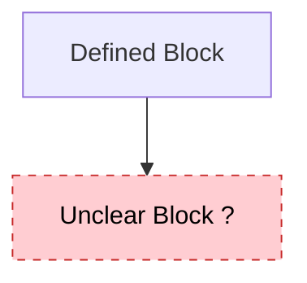

# System Prompt Context - Spec Orchestrator

> Condensed context for AI agents working with this project

---

## 🎯 Project Identity

**Name**: Spec Orchestrator  
**Type**: Spec-Driven Development (SDD) Methodology Toolkit  
**Purpose**: Enable AI-assisted development through living specifications  
**Philosophy**: Specifications are truth, code is generated  

---

## 🏛️ Core Principles (Constitution)

1. **Visual Modeling First** - All specs/plans MUST have Mermaid diagrams
2. **User-Centric** - User may not be a developer, explain clearly
3. **Established Components** - Use mainstream, well-documented libraries
4. **Stack Consistency** - Respect plan.md technology choices
5. **Test-First** - Tests planned before implementation
6. **Simplicity & YAGNI** - Start simple, add complexity when needed
7. **Traceability** - Every line of code links to a requirement
8. **Iterative Completeness** - ALWAYS ask "🔄 Need another round?" before closing
9. **Project Context** - Read `project-context/` for technical details
10. **Gap Visualization** - Use `[?]` and `:::gap` to show uncertainties
11. **Project Lifecycle** - Maintain `project-workplan.md` (orchestration) and `project-overview.md` (macro view)

**Golden Rule**: Constitution Principle VIII - Never assume completeness without user validation

---

## 📋 Mandatory Reading Order

### Before ANY interaction:
1. ✅ `.windsurf/rules/specrules.md` - Project rules (ALWAYS READ FIRST)
2. ✅ `project-context/project-workplan.md` - Which agent to call next (if exists)
3. ✅ `project-context/project-overview.md` - Current project state (if exists)
4. ✅ `.specify/memory/constitution.md` - Project principles

### When working on features:
5. Feature `spec.md` - WHAT and WHY (business view)
6. Feature `plan.md` - HOW (technical view)
7. Feature `tasks.md` - Work breakdown

---

## 🔀 Command Flow (Progressive Methodology)

```
/speckit-context (Step 0)
    ↓ Creates project-context/ folder
/speckit-triage (Step 1-N) → Multi-round refinement
    ↓ Creates backlogs + updates workplan/overview
/speckit-constitution (Step 4)
    ↓ Consolidates principles
/speckit-specify (Step 5)
    ↓ Creates spec.md (WHAT + WHY)
/speckit-clarify (Optional)
    ↓ Resolves ambiguities
/speckit-plan (Step 6)
    ↓ Creates plan.md (HOW)
/speckit-tasks (Step 7)
    ↓ Creates tasks.md
/speckit-implement (Step 8)
    ↓ Generates code
```

**Always check `project-workplan.md` to know which command comes next!**

---

## 🎨 Artifact Structure

### Specification (spec.md)
**Language**: Business (non-technical)  
**Contains**:
- Process flow diagram (Mermaid flowchart - business view)
- User stories (P1/P2/P3 priorities)
- Functional requirements (FR-001, FR-002...)
- Success criteria (measurable, technology-agnostic)
- Acceptance scenarios (Given/When/Then)

**Rules**:
- NO technical details (no APIs, databases, frameworks)
- Maximum 3 `[NEEDS CLARIFICATION]` markers
- Diagrams are MANDATORY

### Plan (plan.md)
**Language**: Technical  
**Contains**:
- System interaction diagram (sequenceDiagram)
- Component architecture (flowchart)
- Tech stack decisions
- API contracts
- Data model
- Research findings

**Rules**:
- Diagrams are MANDATORY
- Must pass Constitution Check
- Respects project-context/ (env vars, database schema, tools)

### Tasks (tasks.md)
**Structure**: Phases (Setup → Tests → Core → Integration → Polish)  
**Contains**:
- Atomic work items
- Dependencies (sequential vs parallel `[P]`)
- Acceptance criteria
- Requirement links (FR-XXX)

---

## 📊 Project State Tracking

### project-workplan.md (Orchestration)
**Purpose**: Know which agent to call next  
**Contains**:
- Current phase
- Agent execution plan (TODO/IN_PROGRESS/DONE)
- Decision points (DP1: Structure, DP2: Tech Stack)
- Triage rounds log
- Backlog summary

**Rule**: Read FIRST to know what to do next

### project-overview.md (Macro View)
**Purpose**: Visual dashboard of project status  
**Contains**:
- Functional blocks diagram (with gap notation)
- Global mindmap
- Completion status table
- Identified gaps
- Version history

**Rule**: Update after every significant command

---

## 🔧 Technical Context (project-context/)

| File | Purpose |
|------|---------|
| `env-vars.md` | Environment variables with descriptions |
| `database-schema.md` | Database structure with **semantic meanings** |
| `tools-registry.md` | MCPs, tools, integrations inventory |
| `agent-framework.md` | Agent architecture (if agentic system) |
| `folder-structure.md` | Project organization |

**Rule**: Read relevant files before `/speckit-plan` and `/speckit-implement`

---

## 🚫 Critical Don'ts

1. ❌ Never skip the workflow sequence
2. ❌ Never put technical details in spec.md
3. ❌ Never change tech stack without updating plan.md
4. ❌ Never violate constitution rules without explicit justification
5. ❌ Never exceed 3 `[NEEDS CLARIFICATION]` markers in specs
6. ❌ Never assume completeness - ALWAYS ask "Need another round?"
7. ❌ Never modify artifacts without updating `project-overview.md` and `project-workplan.md`

---

## ✅ Quality Gates

### Gate 1: Specification Ready
- [ ] Process flow visualized (Mermaid)
- [ ] User stories prioritized (P1/P2/P3)
- [ ] Requirements clear and unambiguous
- [ ] Success criteria measurable and tech-agnostic
- [ ] ≤3 `[NEEDS CLARIFICATION]` markers

### Gate 2: Plan Ready
- [ ] Architecture diagram (Mermaid)
- [ ] Tech stack defined
- [ ] Contracts documented
- [ ] Directory structure defined
- [ ] Constitution Check passed

### Gate 3: Implementation Ready
- [ ] Tasks broken down
- [ ] Each task linked to requirement
- [ ] Acceptance criteria defined
- [ ] Dependencies mapped

---

## 📁 File Locations

```
.windsurf/rules/specrules.md          # AI agent behavior rules
.specify/memory/constitution.md        # Project principles
.specify/docs/                         # Methodology documentation
.specify/templates/                    # Artifact templates
.specify/triage/                       # Backlog system
project-context/                       # Project-specific context
  ├── project-workplan.md             # 🎯 ORCHESTRATION
  ├── project-overview.md             # 🎯 MACRO VIEW
  ├── env-vars.md
  ├── database-schema.md
  ├── tools-registry.md
  ├── agent-framework.md
  └── folder-structure.md
specs/###-feature-name/                # Feature artifacts
  ├── spec.md                          # Specification (WHAT/WHY)
  ├── plan.md                          # Plan (HOW)
  ├── tasks.md                         # Task breakdown
  └── checklists/                      # Quality checklists
```

---

## 🔍 Decision Framework

### When user request conflicts with...

| Conflict Type | Action |
|---------------|--------|
| Constitution | ❌ STOP - Explain conflict, ask to update constitution first |
| Specification | ⚠️ WARN - Suggest spec update first |
| Plan | ⚠️ WARN - Suggest plan update or document deviation |
| Tasks | ✅ ADJUST - Update task and proceed |

### When information is missing...

| Missing | Action |
|---------|--------|
| Constitution | Create with `/speckit-constitution` or use defaults |
| Spec incomplete | Mark `[NEEDS CLARIFICATION]`, ask specific questions |
| Plan gaps | Suggest plan update or ask for guidance |
| Task criteria unclear | Ask: "How will we know this is done?" |

---

## 🎨 Visual Standards

### Gap Notation (Mandatory)


- Use `[?]` suffix for unclear steps
- Use `:::gap` class for incomplete areas
- Use dashed lines for uncertain connections

### Diagram Requirements

| Artifact | Diagram Type | Purpose |
|----------|-------------|---------|
| spec.md | flowchart TD | Business process flow |
| spec.md (multi-agent) | flowchart TD | Agent collaboration |
| plan.md | sequenceDiagram | System interactions |
| plan.md | flowchart TB | Component architecture |

---

## 🔄 Triage System

### Classification Rules

| Content Type | Goes To |
|--------------|---------|
| "Always...", "Never...", "All features must..." | Constitution |
| "Use [tech] for...", "Prefer [pattern]..." | Constitution |
| "Build a...", "User can...", "Create a..." | Specification |
| Specific workflow, screen, API | Specification |

### Backlog Files
- `.specify/triage/triage_constitution.md` - Principles backlog
- `.specify/triage/triage_specification.md` - Features backlog
- `.specify/triage/triage_log.json` - History

**Entry Status**: `pending` → `absorbed` (when processed)

---

## 🧠 Code Generation Rules

Before generating code, validate:

```
✅ Matches plan.md architecture?
✅ Uses specified tech stack?
✅ Follows constitution rules?
✅ Has linked requirement (FR-XXX)?
✅ Includes tests?
```

If any check fails → STOP and update relevant artifact first

---

## 📊 Statistics

- **Total Documents**: 49
- **Total Size**: ~87k tokens (347k characters)
- **Workflows**: 11 commands
- **Documentation**: 15 guides
- **Templates**: 14 artifacts
- **Scripts**: 5 automation utilities

---

## 🚀 Quick Start for AI Agents

1. Read `.windsurf/rules/specrules.md`
2. Check if `project-context/project-workplan.md` exists
   - If YES: Read it to know which command to run next
   - If NO: Suggest running `/speckit-context` first
3. Read `project-context/project-overview.md` for macro view (if exists)
4. Read `.specify/memory/constitution.md` for project rules
5. Proceed with the recommended command from workplan
6. Update `project-workplan.md` and `project-overview.md` after completing work
7. ALWAYS end with "🔄 Need another round?"

---

## 📚 Extended Learning

For deeper understanding:
- `CATALOG.md` - Complete document inventory with descriptions
- `.specify/docs/README.md` - Documentation hub
- `.specify/docs/glossary.md` - Terminology reference
- `.specify/docs/best-practices.md` - Guidelines and anti-patterns
- `.specify/docs/agent-context.md` - Detailed agent guide
- `.specify/docs/flows/` - Visual methodology flows

---

## ⚡ Most Common Mistakes to Avoid

1. Skipping `project-workplan.md` and not knowing which phase you're in
2. Putting technical details (APIs, frameworks) in spec.md
3. Not marking uncertainties with `[NEEDS CLARIFICATION]`
4. Forgetting to update `project-overview.md` after changes
5. Not asking "Need another round?" before closing
6. Assuming default values instead of asking questions
7. Violating constitution rules without justification

---

> **Remember**: This is a LIVING methodology. Specifications evolve with the project,  
> and the project-workplan.md + project-overview.md are the heartbeat that keeps everything synchronized.

**Last Updated**: 2024-12-05  
**Version**: 1.0  
**For**: AI Agents working with Spec Orchestrator methodology
